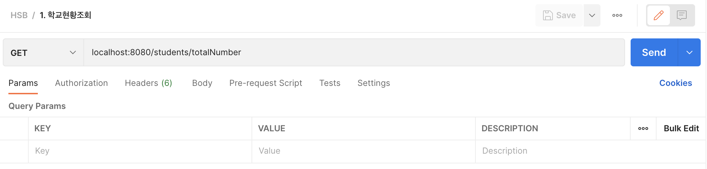
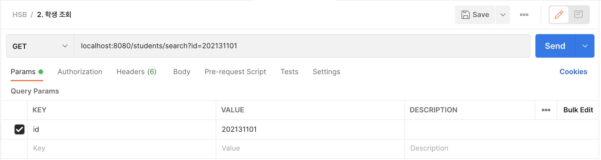
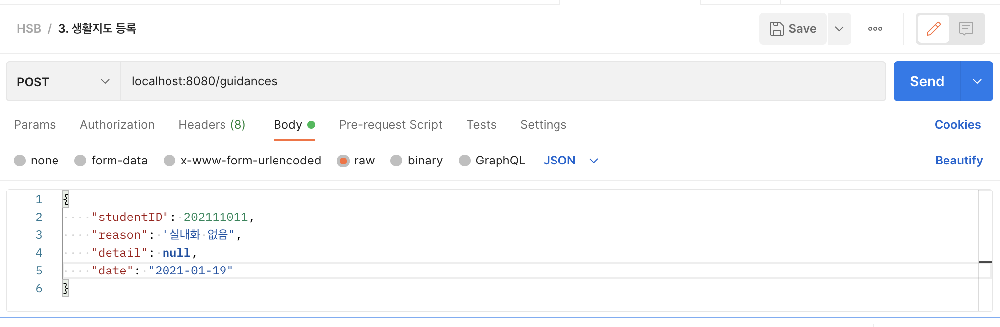
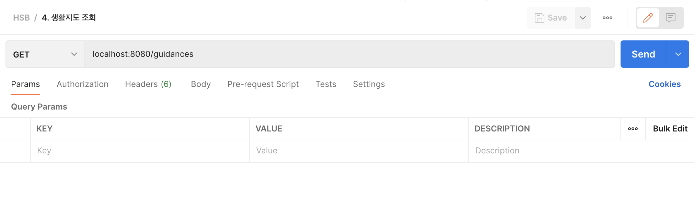
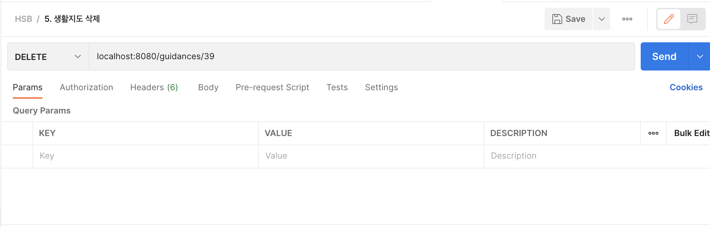
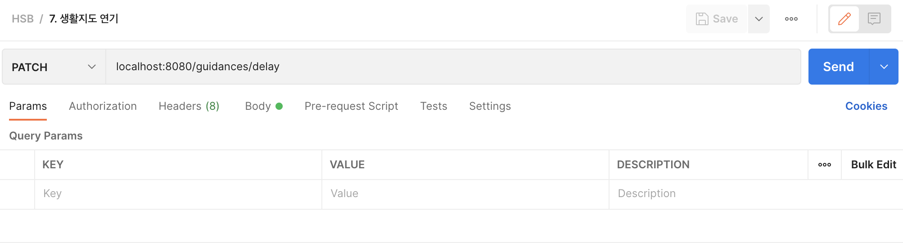

#  학생부 프로젝트 서버 🧑‍🏫

하나의 앱을 클라이언트, 서버를 모두 스스로 구현하기 위해서 시작한 프로젝트입니다.

학생부 교사를 중심으로 학생들의 생활교육을 전교사가 공유하기 위한 앱입니다.

이 프로젝트에 대한 자세한 내용은 아래 블로그에서 보실 수 있습니다. 

👉 [개발 과정 자세히 보기](https://velog.io/@comdongsam/series/%ED%95%99%EC%83%9D%EB%B6%80-%EC%95%B1-%EA%B0%9C%EB%B0%9C-%EB%8F%84%EC%A0%84%EA%B8%B0)

클라이언트(iOS) 코드는 아래 깃허브 주소에서 보실 수 있습니다.

👉 [클라이언트(iOS) 코드 보러가기](https://github.com/SteadySlower/HSB)

✋ 본서버는 위 iOS 앱을 위해 최소한만 구현된 서버입니다. 에러 처리 및 validation이 생략되어 있습니다.

# API 설계 ⚙️
1. [GET] 학교의 학년별 반 갯수, 반별 학생수 조회

2. [GET] 학생 이름 및 사진 조회

3. [POST] 생활지도 등록

4. [GET] 생활지도 명단 조회

5. [DEL] 생활지도 삭제

6. [PATCH] 생활지도 완료 처리

7. [PATCH] 생활지도 연기 처리

# 개발 블로그 북마크  📑

[0. 개발 목적 및 개요](https://velog.io/@comdongsam/0.-%ED%95%99%EC%83%9D%EB%B6%80-%EC%95%B1-%EA%B0%9C%EB%B0%9C-%EC%8B%9C%EC%9E%91%ED%95%A9%EB%8B%88%EB%8B%A4)
 
[1. 학생 얼굴 조회](https://velog.io/@comdongsam/1.-%ED%95%99%EC%83%9D-%EC%96%BC%EA%B5%B4-%EC%A2%80-%EB%B4%85%EC%8B%9C%EB%8B%A4-by-UICollectionView)

[2. 학칙 어긴 학생 등록](https://velog.io/@comdongsam/2.-%ED%95%99%EC%83%9D-%EB%B3%B5%EC%9E%A5%EB%B6%88%EB%9F%89)
 
[3. 생활지도명단 몰아보기](https://velog.io/@comdongsam/3.-%EB%88%84%EA%B0%80%EB%88%84%EA%B0%80-%EA%B1%B8%EB%A0%B8%EB%82%98-by-UITableView)
 
[4. 서버 개발 시작](https://velog.io/@comdongsam/4.-%EC%84%9C%EB%B2%84-%EA%B0%9C%EB%B0%9C-%EC%8B%9C%EC%9E%91)
 
[5. 서버에서 데이터 가져오기](https://velog.io/@comdongsam/5.-%EC%84%9C%EB%B2%84%EC%97%90%EC%84%9C-%EB%8D%B0%EC%9D%B4%ED%84%B0-%EA%B0%80%EC%A0%B8%EC%98%A4%EA%B8%B0)
 
[6. 서버에 데이터 보내기](https://velog.io/@comdongsam/6.-%EA%B5%90%EB%AC%B8%EC%97%90%EC%84%9C-%EC%84%9C%EB%B2%84%EB%A1%9C)
 
[7. 알람 기능 구현](https://velog.io/@comdongsam/7.-%EC%84%A0%EC%83%9D%EB%8B%98-%EC%A2%85%EB%A1%80%ED%95%A0-%EC%8B%9C%EA%B0%84%EC%9E%85%EB%8B%88%EB%8B%A4)
 
[8. 봉사지도 기능 구현](https://velog.io/@comdongsam/8.-%EC%8C%A4-%EC%A0%80-%EC%98%A4%EB%8A%98-%ED%95%99%EC%9B%90-%EA%B0%80%EC%95%BC%ED%95%98%EB%8A%94%EB%8D%B0%EC%9A%94). 

# 사용한 기술 🛠
## 클라이언트 (iOS)
- Swift, UIKit
- StoryBoard 없이 순수 코드로 UI 구현
- MVVM, Singleton, Delegate
- Swift Package Manager, Alamofire, Kingfisher
- Xcode, iOS simulator
## 서버 (nodejs)
- javascript, expressjs, npm, mysql2, pm2
- MySQL
- Visual Studio Code, Postman, MySQL WorkBench
## 공통
- git, github

# Postman 갤러리 📷

1. [GET] 학교의 학년별 반 갯수, 반별 학생수 조회

```json
{
    "isSuccess": true,
    "code": 1000,
    "message": "성공",
    "result": {
        "numOfClasses": {
            "1": 10,
            "2": 11,
            "3": 14
        },
        "numOfStudents": {
            "1": {
                "1": 30,
                "2": 31,
                "3": 32,
                "4": 33,
                "5": 34,
                "6": 35,
                "7": 36,
                "8": 37,
                "9": 38,
                "10": 39
            },
            "2": {
                "1": 30,
                "2": 31,
                "3": 32,
                "4": 33,
                "5": 34,
                "6": 35,
                "7": 36,
                "8": 37,
                "9": 38,
                "10": 39,
                "11": 40
            },
            "3": {
                "1": 30,
                "2": 31,
                "3": 32,
                "4": 33,
                "5": 34,
                "6": 35,
                "7": 36,
                "8": 37,
                "9": 38,
                "10": 39,
                "11": 40,
                "12": 41,
                "13": 42,
                "14": 43
            }
        }
    }
}
```

2. [GET] 학생 이름 및 사진 조회

```json
{
    "isSuccess": true,
    "code": 1000,
    "message": "성공",
    "result": {
        "id": 202131101,
        "grade": 3,
        "classNumber": 11,
        "number": 1,
        "name": "양민희",
        "profileImageURL": "https://picsum.photos/200",
        "status": "재학",
        "createdAt": "2021-12-21T02:09:11.000Z",
        "updatedAt": "2021-12-21T02:09:11.000Z"
    }
}
```

3. [POST] 생활지도 등록

```json
{
    "isSuccess": true,
    "code": 1000,
    "message": "성공",
    "result": {
        "studentID": 202111011,
        "grade": 1,
        "classNumber": 10,
        "number": 11,
        "name": "정강호",
        "profileImageURL": "https://picsum.photos/200",
        "guidanceID": 40,
        "reason": "실내화 없음",
        "detail": null,
        "date": "2021-01-19",
        "status": "VALID"
    }
}
```

4. [GET] 생활지도 명단 조회

```json
{
    "isSuccess": true,
    "code": 1000,
    "message": "성공",
    "result": [
        {
            "studentID": 202111011,
            "grade": 1,
            "classNumber": 10,
            "number": 11,
            "name": "정강호",
            "profileImageURL": "https://picsum.photos/200",
            "guidanceID": 16,
            "reason": "실내화 없음",
            "detail": null,
            "date": "2022-01-22",
            "status": "DELAYED"
        },
        {
            "studentID": 202120817,
            "grade": 2,
            "classNumber": 8,
            "number": 17,
            "name": "장예지",
            "profileImageURL": "https://picsum.photos/200",
            "guidanceID": 17,
            "reason": "실내화 없음",
            "detail": null,
            "date": "2022-01-22",
            "status": "DELAYED"
        },
        {
            "studentID": 202120518,
            "grade": 2,
            "classNumber": 5,
            "number": 18,
            "name": "성윤희",
            "profileImageURL": "https://picsum.photos/200",
            "guidanceID": 18,
            "reason": "실내화 없음",
            "detail": null,
            "date": "2021-01-19",
            "status": "VALID"
        }
    ]
}
```

5. [DEL] 생활지도 삭제


6. [PATCH] 생활지도 완료 처리


7. [PATCH] 생활지도 연기 처리



# Trouble Shooting 아카이브 🤔


